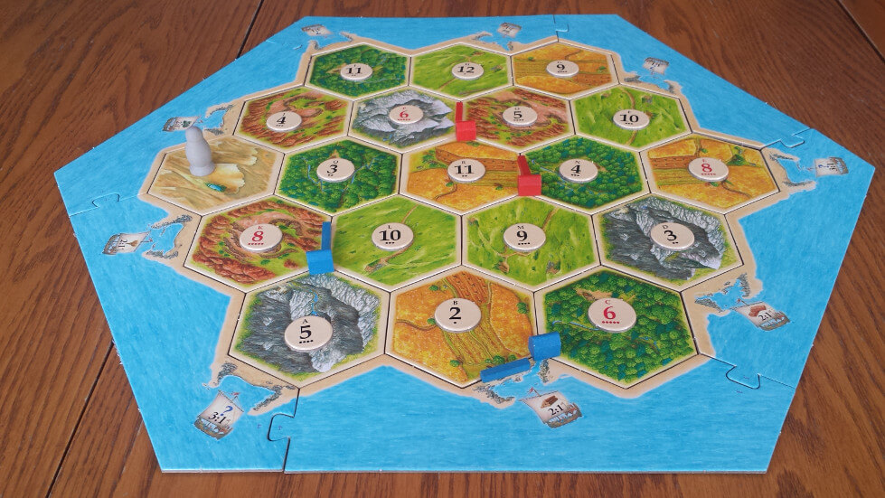

## Settlers of Catan

### Abstract
This project is designed to find the best strategy to recieve the most resource cards form the first two settlements. We will be comparing two different methods to recieve the most resource cards.

  - Placing settlements on the same high probability number
  - Placing settlements in places with a variety of numbers where they don't match

### The Board
We will be using this image of the board as a reference point:


### Players

We will use 2 players as a reference since we are only testing 2 different methods to receive resource cards. I have hardcoded in the placements for the players based on what looks favorable for both players.

```{r}

player1 <- data.frame(
  placement <- c(c(8,5,10), c(4,8,10))
)

player2 <- data.frame(
  placement <- c(c(6,9,3), c(5,11,4))
)

```

### Gameplay

The next items we will need to simulate are the dice and the cards. We will not need to know the card types for this simulation. We will only need to count how many cards each player receives. In order to simulate a game we will create a function that simulates a single game. The estimated number of rolls per player is about 20 rolls per player based on research so we will set the number of rolls to 40.

```{r}

play_game <- function(rolls, player1, player2){
  dice <- c(1:6)
  all_rolls <- sample(dice, rolls, replace = TRUE) + sample(dice, rolls, replace = TRUE)
  cards_recv1 <- sum(player1$placement[player1$placement %in% all_rolls])
  cards_recv2 <- sum(player2$placement[player2$placement %in% all_rolls])
  result <- c(cards_recv1, cards_recv2)
  return(result)
}

result <- play_game(40, player1 = player1, player2 = player2)
player1_card_amount <- result[1]
player2_card_amount <- result[2]

```

From one game, we can see **Player 1 received `r player1_card_amount` cards** and **Player 2 received `r player2_card_amount` cards**.

### Simulating Multiple Games

The next order of business is being able to simulate more than one game at a time to determine if there is a definite difference based on the placement. From this we can determine a variety of different statistics such as average cards received in a game and how many games that a player received more cards than a player.

```{r}

game_tracker <- data.frame(
    player1_most_cards <- c(),
    player1_card_amount <- c(),
    player2_most_cards <- c(),
    player2_card_amount <- c()
  )

play_games <- function(n_games, n_rolls, player1, player2, game_tracker){

  tie <- 0
  for (i in 1:n_games){
    result <- play_game(n_rolls, player1, player2)
    player1_result <- result[1]
    player2_result <- result[2]
    append(game_tracker$player1_card_amount, player1_result)
    append(game_tracker$player2_card_amount, player2_result)
    if (player1_result > player2_result) {
      append(game_tracker$player1_most_cards, 1)
      append(game_tracker$player2_most_cards, 0)
    } else if (player1_result < player2_result) {
      append(game_tracker$player2_most_cards, 1)
      append(game_tracker$player1_most_cards, 0)
    } else {
      tie <- tie + 1
    }
  }
  outcome <- c(sum(game_tracker$player1_most_Cards), sum(game_tracker$player2_most_cards), tie)
  return(outcome)
}

outcome <- play_games(100, 40, player1 = player1, player2 = player2, game_tracker = game_tracker)
outcome
```

